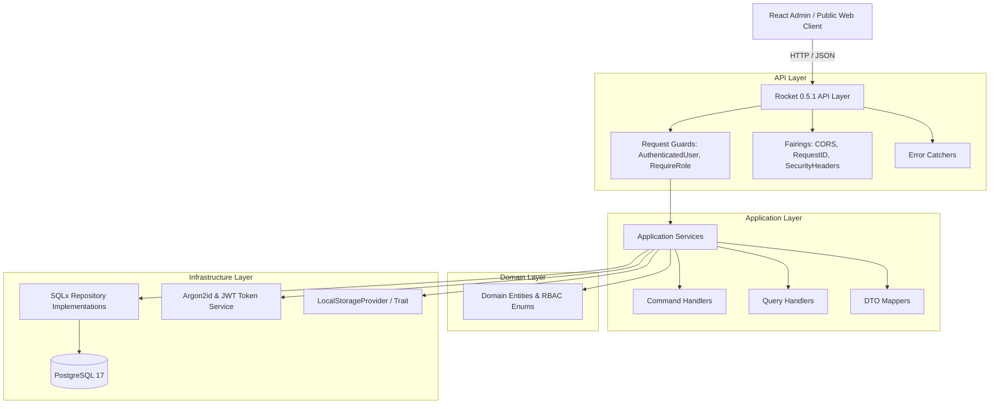
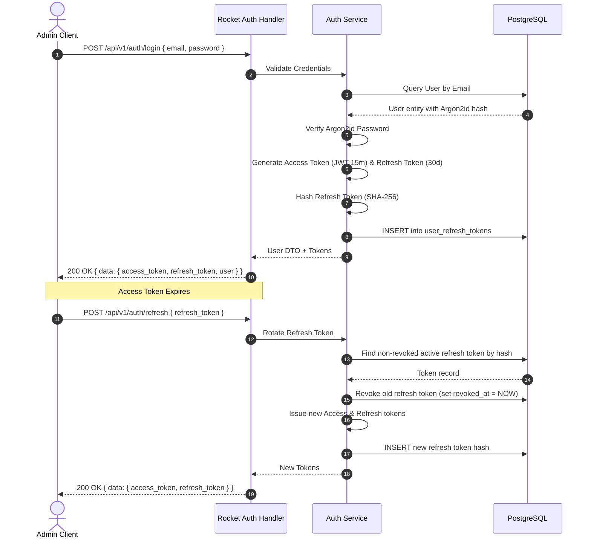
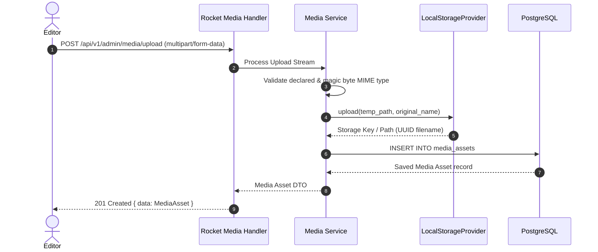
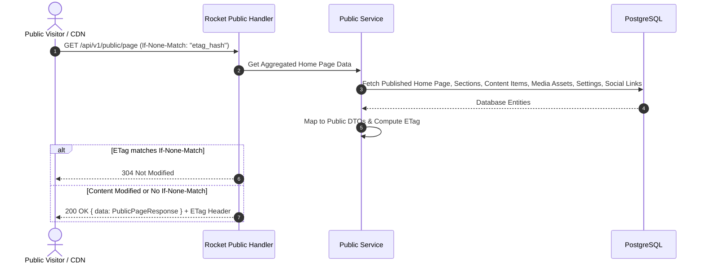

# Architecture Specification & Mermaid Diagrams

## 1. Modular Layering Architecture

## 2. Authentication & Refresh Flow

## 3. Media Upload & Storage Trait Flow

## 4. Public Page Query & ETag Flow

